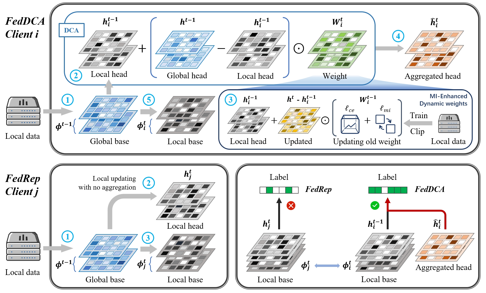

# Introduction

FedDCA: Dynamic Contrastive Aggregation with Mutual-Information-Enhanced for Personalized Federated Learning

Take away: We enhance the typical PFL method FedRep with Dynamic Contrastive Aggregation (DCA) and Mutual Information Learning (MIL), making it more versatile and resilient to various data heterogeneities.

The learning process in FedRep and our FedDCA on client $i$ in the $t$-th iteration. Here, we consider a four-layer model. The darker the color, the larger the value. With the external dynamic information brought by the Aggregated head, our FedDCA can perform effective classification compared to FedRep.

# Datasets and Environments

Due to the file size limitation, we only upload the statistics (`config.json`) of the Cifar10 dataset in the practical setting ($\beta=0.1$). Please refer to the popular repository [PFLlib](https://github.com/TsingZ0/PFLlib) to generate all the [datasets](https://github.com/TsingZ0/PFLlib?tab=readme-ov-file#datasets-and-scenarios-updating) and create the required python [environment](https://github.com/TsingZ0/HtFLlib?tab=readme-ov-file#environments).

# System

Learning reasonable global prototypes can be challenging in some cases, particularly due to the limited number of client prototypes and the introduced adaptive margin during ACL. To address this, consider setting a larger `top_cnt` and ensuring that the global communication iteration number is larger than 1000, which should result in a `Server loss` smaller than 0.001. The best accuracy is typically achieved when a minimal `Server loss` is obtained. In most of our experiments, we achieved a `Server loss` of 0.0. 

- `main.py`: system configurations. 
- `flcore/`: 
    - `clients/`: the code on clients. See [PFLlib](https://github.com/TsingZ0/PFLlib) for baselines.
    - `servers/`: the code on servers. See [PFLlib](https://github.com/TsingZ0/PFLlib) for baselines.
    - `trainmodel/`: the code for some heterogeneous client models. 
- `utils/`:
    - `data_utils.py`: the code to read the dataset. 
    - `mem_utils.py`: the code to record memory usage. 
    - `result_utils.py`: the code to save results to files.

# Training and Evaluation

All codes are stored in `./system`.
